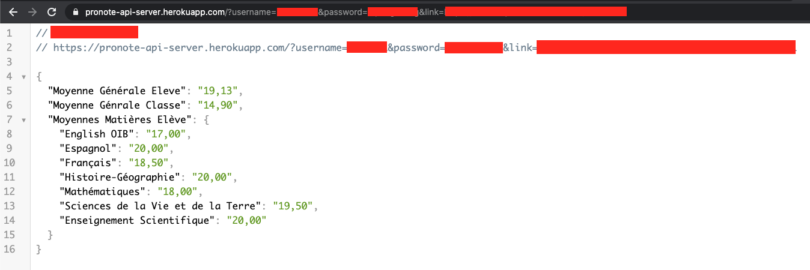

# PRONOTE-API 📈 📈 📈
## API non-officiel pour le site Pronote

## Comment utiliser l'API ?

Afin d'utiliser cette API Pronote, faites simplement une 
```GET```
request en incluant dans l'url les paramètres suivant:

```https://pronote-api-server.herokuapp.com/?username=<votre_nom_d_utlisateur_pronote>&password=<votre_mot_de_passe_pronote>&link=<lien_du_formulaire_de_connection_eleve_de_votre_etablissement>```

Exemple ici (les données sensitives sont cachées par des rectangles rouges):



Si vous rentrez bien les bon paramètres, une réponse contenant un fichier JSON vous sera renvoyé. Ce dernier possèdera un grand nombre de données (notes, moyennes, punitions, devoirs...).

(Le fichier JSON envoyé est pour l'instant assez peu fourni. Toutefois, pas d'inquiétudes il sera bientôt complet)

## Vous ne souhaitez pas que vos mots de passe et identifiant passe par nos serveurs ? Pas de problème !

( Je vous assure tout de même qu'aucune donnée que ce soit mots de passe, identifiants, notes... n'est sauvegardez. Gardez à l'esprit que nos serveurs heroku sont directement connectés à la branche 
```main```
de ce répository. Vous pouvez donc allez vérifier le code par vous-même.)

Vous pouvez aussi faire tourner le code sur votre propre machine.

Pour cela ouvrez votre terminal et clonez notre repertoire en entrant la commande suivante:

```git clone https://github.com/science-math-guy/PRONOTE-API.git```

Afin de faire 'executer' le code, entrez la commande suivante:

```node server.js```

Puis rendez-vous sur votre navigateur et entrez l'url suivante en remplaçant bien les paramètres par les votres:

```http://localhost:3000/?username=<votre_nom_d_utlisateur_pronote>&password=<votre_mot_de_passe_pronote>&link=<lien_du_formulaire_de_connection_eleve_de_votre_etablissement>```

Le code est donc directement tourné sur votre ordinateur et vos mots de passe et identifiants ne sont donc pas envoyé sur d'autre serveurs.


