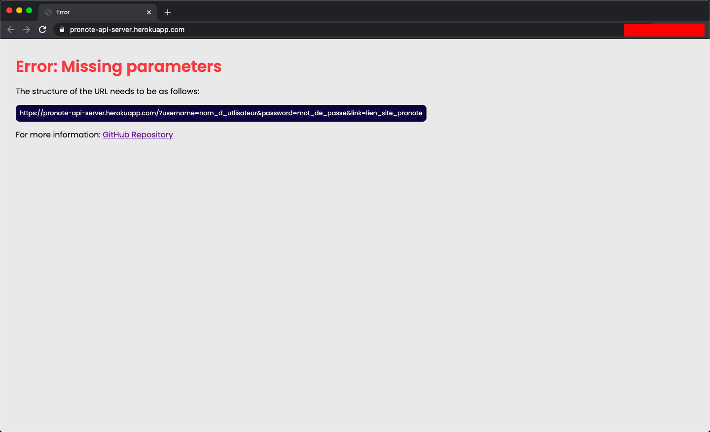

# PRONOTE-API 📈 📈 📈
## API non-officiel pour le site Pronote

## Comment utiliser l'API ?

Afin d'utiliser cette API Pronote, faites simplement une 
```GET```
request en incluant dans l'url les paramètres suivant:

```https://pronote-api-server.herokuapp.com/?username=<votre_nom_d_utlisateur_pronote>&password=<votre_mot_de_passe_pronote>&link=<lien_du_formulaire_de_connection_eleve_de_votre_etablissement>```

Exemple ici (les données sensitives sont cachées par des rectangles rouges):


Si vous rentrez bien les bon paramètres, une réponse contenant un fichier JSON vous sera renvoyé. Ce dernier possèdera un grand nombre de données (notes, moyennes, punitions, devoirs...).

Si jamais vous ne rentrez pas tout les paramètres ou de mauvais paramètres alors il devrait s'affichait une page comme celle-ci:



## Mes données (mot de passe, identifiant...) sont-ils enregistrées quelque part ?

Non. Pour l'instant aucune donnée n'est enregistrée. Vous pouvez aller le code de la branche 
```main``` si vous en êtes pas sûr. Cette dernière est en effet directement connectée à notre serveur Heroku.

Toutefois, il est prévu de sauvegarder le nom d'utilisateur seulement dans une base de donnée dans le but de controler le nombre de requests que chaque utilisateur fait.
 
## Vous ne souhaitez tout de même pas que vos mots de passe et identifiants passent par nos serveurs ? Pas de problème !

Vous pouvez aussi faire tourner le code sur votre propre machine.

Pour cela ouvrez votre terminal et clonez notre repertoire en entrant la commande suivante:

```git clone https://github.com/science-math-guy/PRONOTE-API.git```

Afin de faire 'executer' le code, entrez la commande suivante:

```node server.js```

Puis rendez-vous sur votre navigateur et entrez l'url suivante en remplaçant bien les paramètres par les votres:

```http://localhost:3000/?username=<votre_nom_d_utlisateur_pronote>&password=<votre_mot_de_passe_pronote>&link=<lien_du_formulaire_de_connection_eleve_de_votre_etablissement>```

Le code est donc directement tourné sur votre ordinateur et vos mots de passe et identifiants ne sont donc pas envoyé sur d'autre serveurs.

## Allez-vous rajoutez plus de données dans le fichier JSON ?

Oui. Ce projet de créer une API pour le site web de Pronote est encore récent. Actuellement, l'API est déployé sur la plateforme Salesforce Heroku, toutefois, cela reste un MVC (Minimal Viable Product).

L'API va donc être énormément updaté pendant ces prochains jours.

## Quelles technologies furent-utilisés ?

### Langages:

- JavaScript (NodeJS)
- HTML
- CSS

### NPM packages

- Express
- Dotenv
- Chalk
- Puppeteer
- Puppeteer-extra
- Puppeteer-extra-plugin-stealth
- Puppeteer-extra-plugin-anonymize-ua

- Nodemon (dev dependency)


